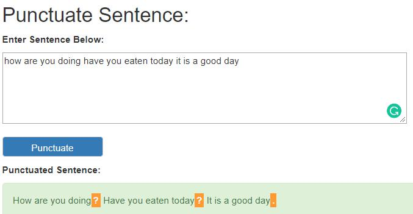

## Flask web application to serve punctuation model

### Summary:
A simple Flask web application allowing users to visit and make punctuation on un-punctuated sentences.  
Model used is based on https://github.com/LeoTSH/cnn_lstm_pos_tagger

**Input:** Sentence without punctuation  
**Output:** Sentence with predicted punctuations

### Requirements:
As a prerequisite, please kindly ensure that the [Anaconda](https://www.anaconda.com/download/) package has been installed.

Below are additional packages needed to run the code.
```
Keras: 2.2.4  
Python: 3.6.7  
Tensorflow-gpu: 1.12.0
flask: 1.0.2
```

### Project folder/files structure:
```
├───data
├───images
├───models
├───static
│   ├───css
│   └───script
└───templates
```

#### Folders:
* **data:** Contains the json mapping of words/labels to integer tokens
* **images:** Contains images used for the repo
* **models:** Contains the pre-trained models
* **static > css:** Contains the css settings for the web application
* **static > script:** Contains the javascript used for the web application
* **templates:** Contains the template html files used for the web application

#### Files:
* **main.py:** Main python file containing the code to run the web application and process the input data
* **README.md:** Readme file for the repo

### Usage:
1. Clone the repo
2. Change/access the directory from command-line
3. Run the command `python main.py` to start the web application
4. Navigate to the [localhost website](http://localhost:5000)
5. Enter un-punctuated text and click on "Punctuate" to make predictions

### Example Results (Success/Error):


